# Task-Manager
Task Manager Loan Application is a web-based application developed using Php, MySql, Ajax, JavaScript, HTML, and CSS. It is designed to track the Loan Application process status for Loan Management Companies.

## Features

The application comes with the following key features:

- **Super Admin Panel:**
  - Create and manage branches for Loan Management Company.
  - Add and manage users for each branch.
  - Assign Loan Applications to users in any branch.

- **Loan Application Processing:**
  - The Coordinator and Processor both have the rights to process loan applications.
  - Track the status of each loan application.
  - Record the time taken by individual users to complete tasks or check the task's progress.

## Technology Stack

The application is built using the following technologies:

- **Backend:**
  - PHP: Server-side scripting language to handle backend logic and database interactions.
  - MySQL: Relational database management system to store and manage loan application data.

- **Frontend:**
  - HTML: Markup language for structuring the web pages.
  - CSS: Stylesheet language for styling the web pages.
  - JavaScript: Scripting language to add interactivity to the application.
  - Ajax: Technology for asynchronous data exchange between the client and server.

## Installation and Setup

1. Clone the repository:
2. Upload the folder in the root folder.
3. Import the Database tasker.sql.
4. Change the Database credentials in db_connect and run the application.

# Images
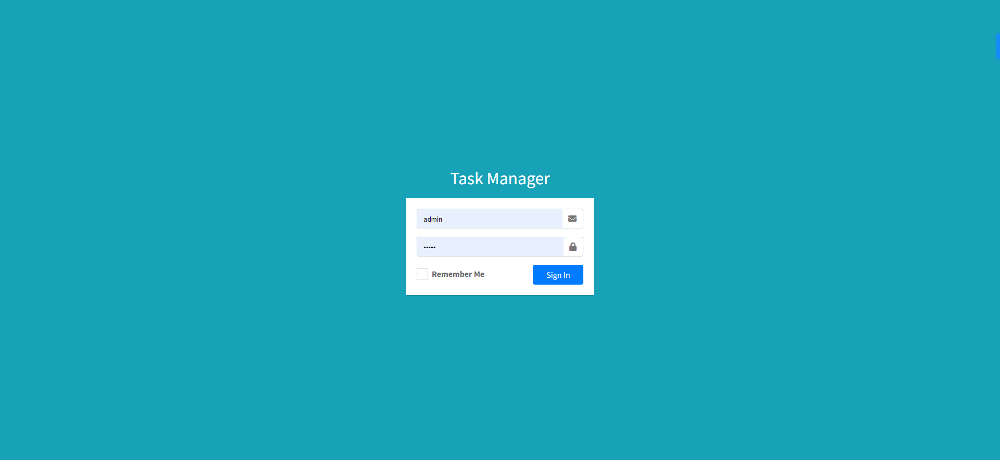
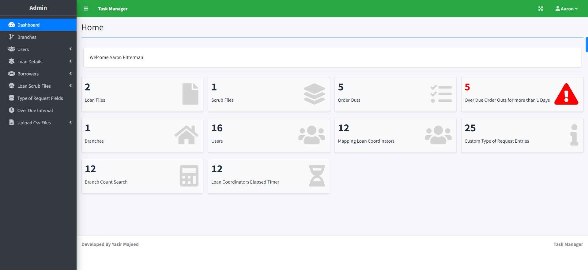
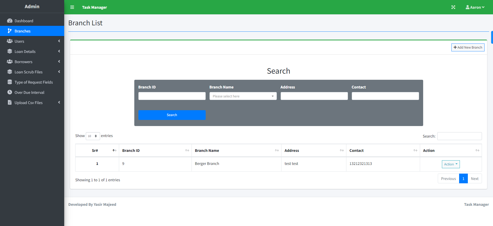
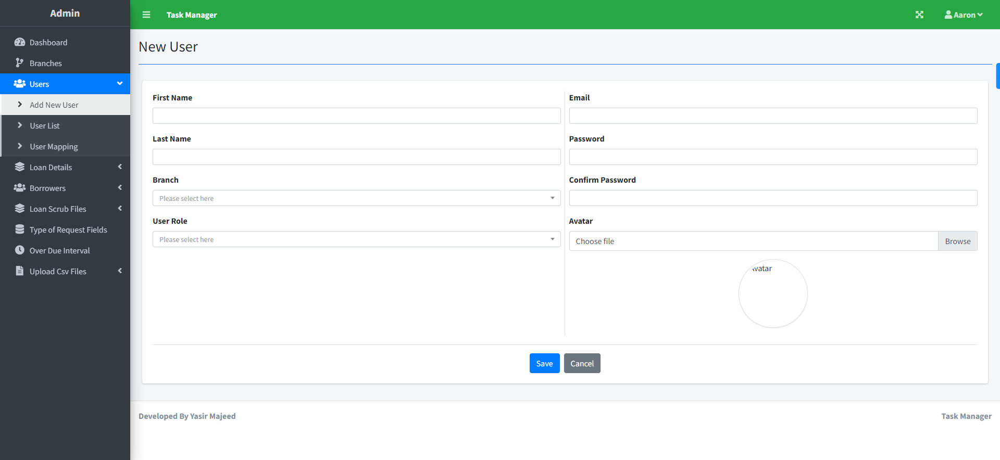
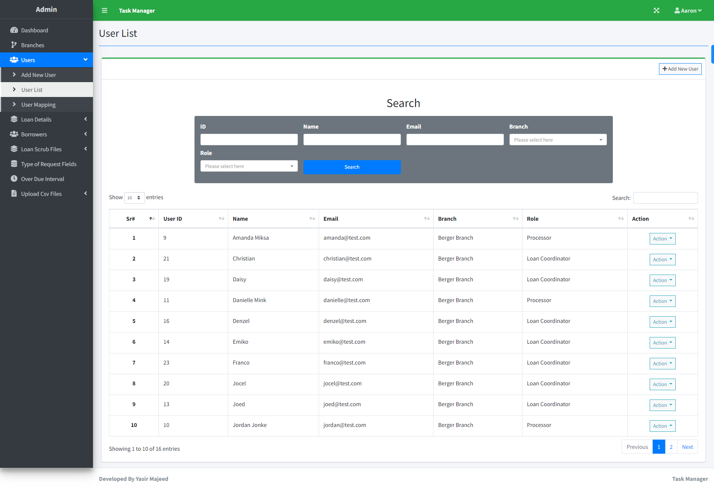
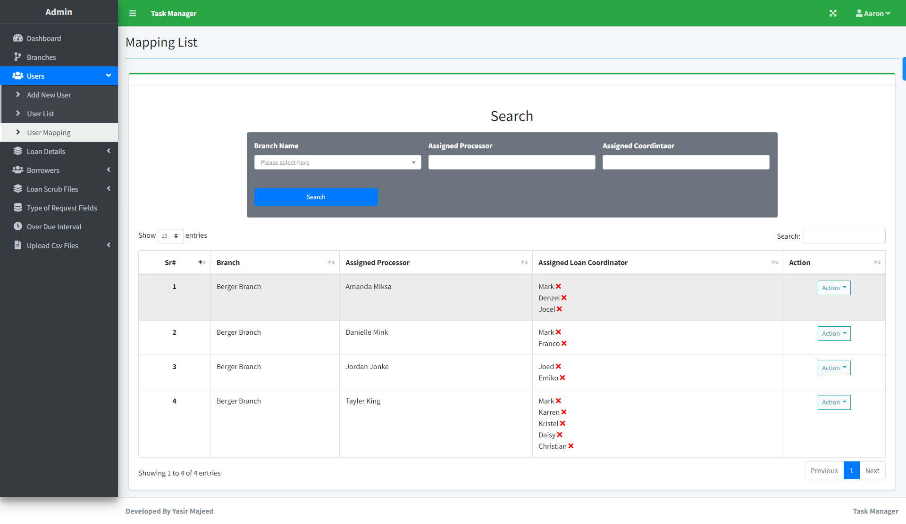
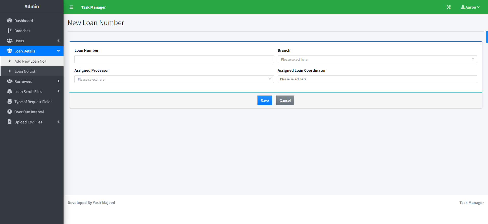

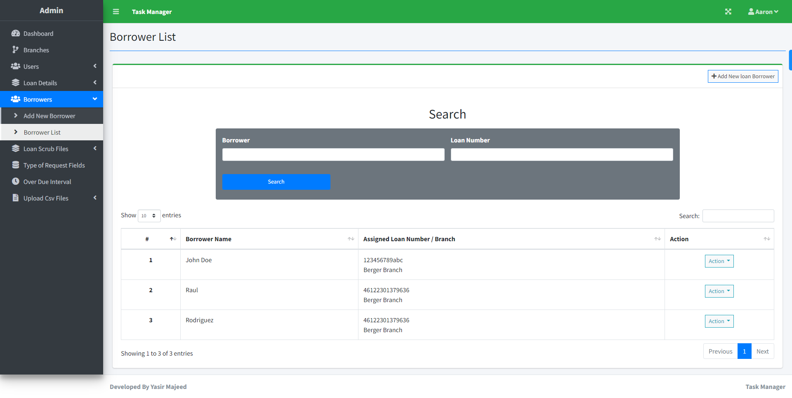
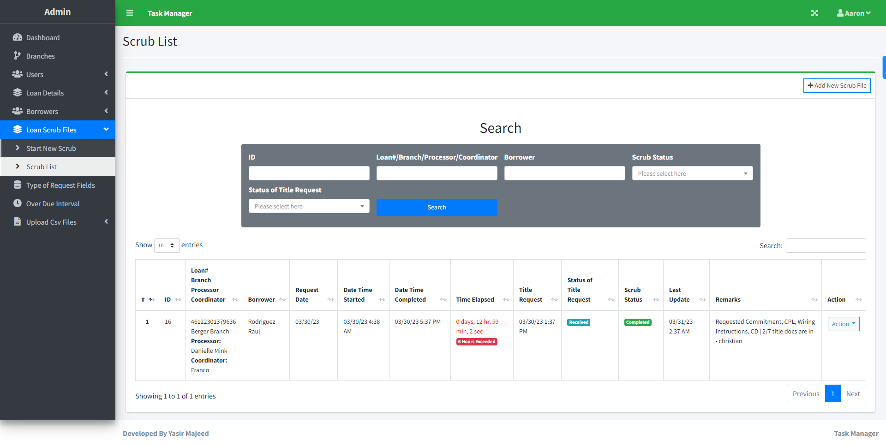
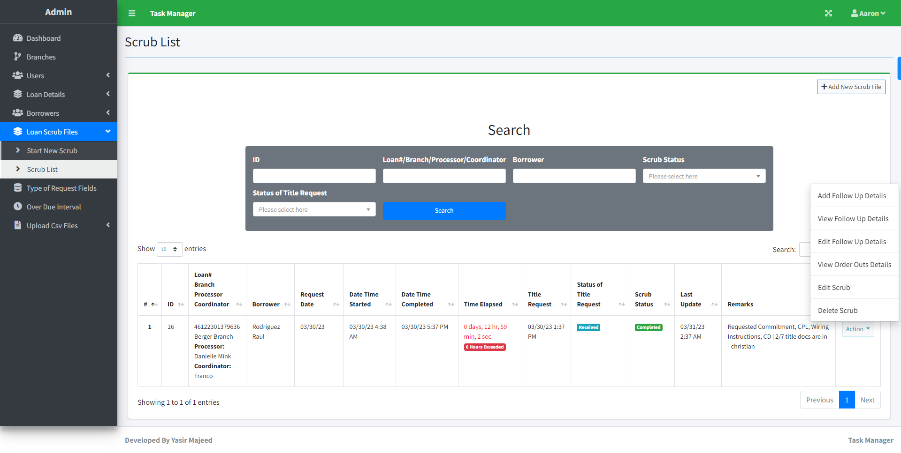
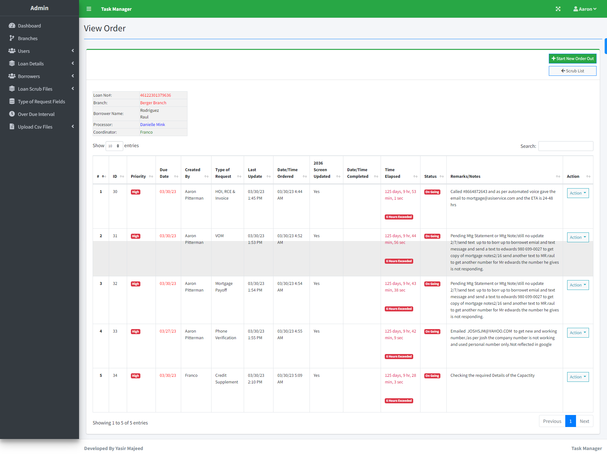
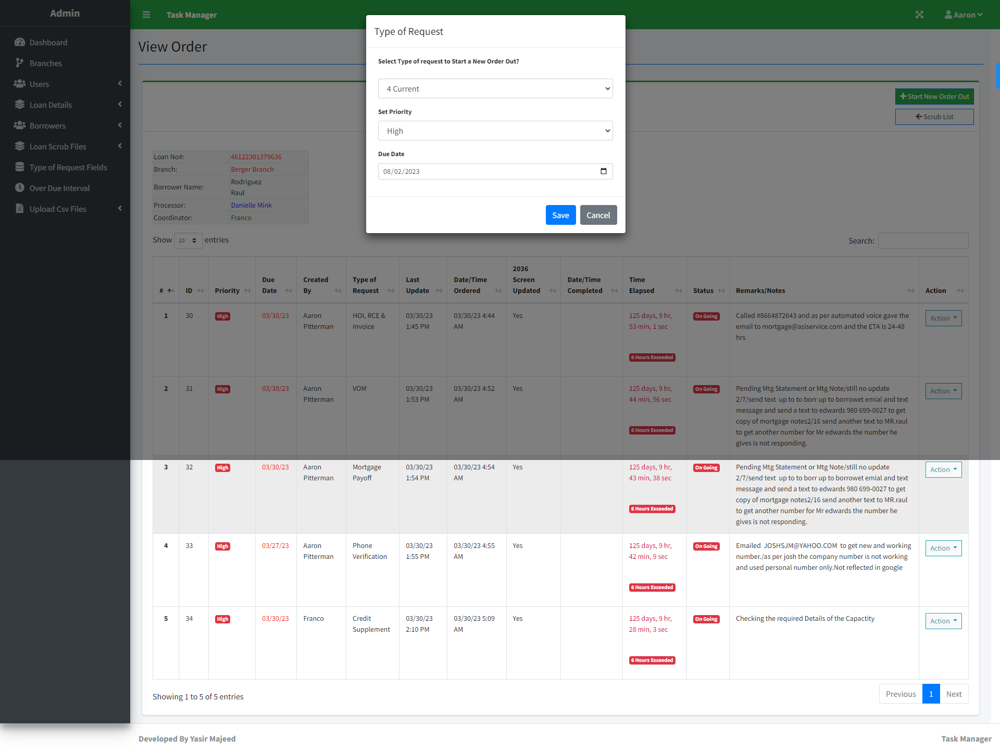
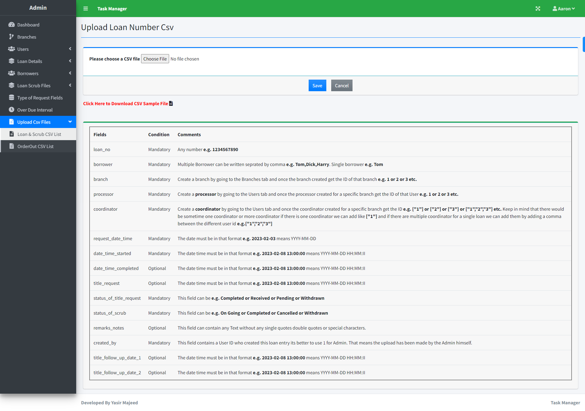
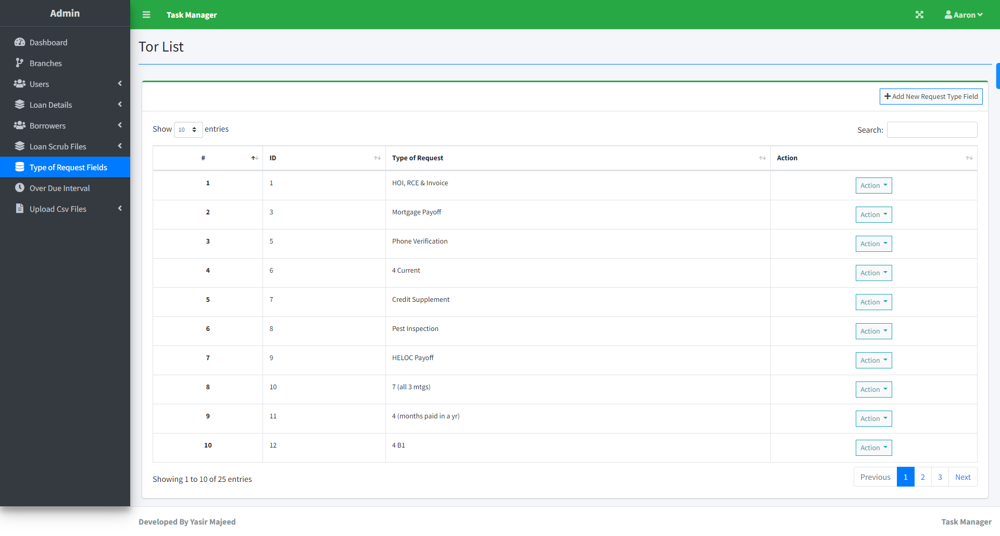
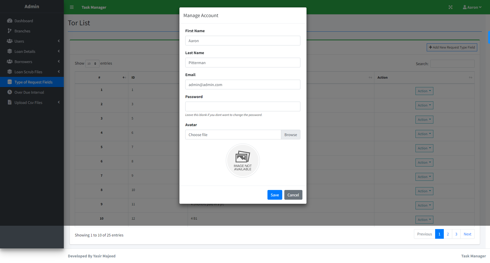

# Login Details for SuperAdmin
email: admin@admin.com
password: admin
